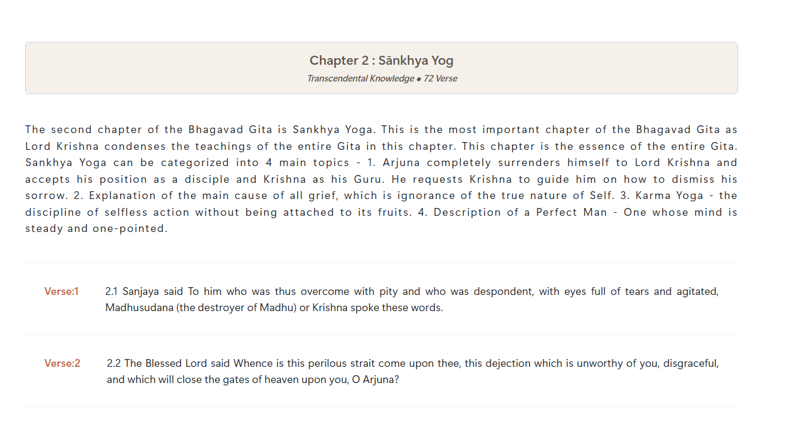
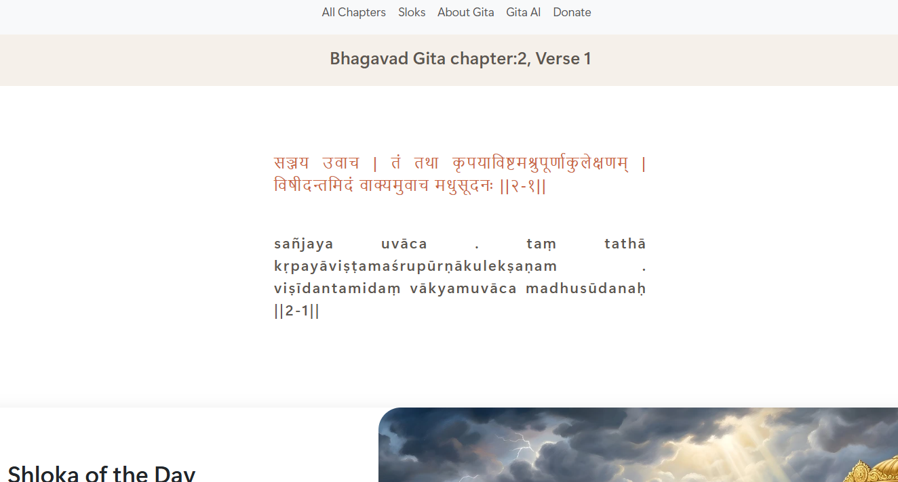

  <h2>
            ### Bhagwad-Gita Website
</h2>

        ==> Website that displays API fetched Data in Chapters , Verses & Slok Forms. 

<h3>
        #Features:
</h3>

        - Read & explore Bhagwad-Gita Chapters.
        - Read Verse & slok  chapter-wise.
        - Form: Joining source to Our Community.
        - Simple and clean UI
        - Beginner-friendly JavaScript

<h3>
        # Technologies Used
</h3>

- HTML
- CSS
- JavaScript
- Bootstrap
- Bhagavad Gita API (vedicscriptures.github.io)

<h3>
            ## Folder Structure
        </h3>
<ul>
<li>  index.html</li>
 <li> chapter.html</li>           
<li><b>   css/ </b></li>          
 -files            
            
   <li> <b>  js/ </b></li>         
  -files       
    
   <li> <b> assets/ </b></li>         
            
 -css
 -fonts
 -img          
 -js
        
<li><b>readme/  </b></li>      
    -files
    -screenshot     
        
</ul>   

<h2>
            ## Screenshots
        </h2>
<h4>Verses : Chapter-wise</h4>

 

<h4>Slok : Verse-wise</h4>

 
        

<h3>
            ## Credits
           
</h3>

            Data provided by vedicscriptures.github.io
        
